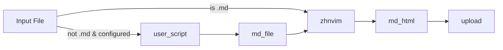

# Zhihu on Neovim

[中文版](./doc/zh_cn.md)

Using [neovim](https://github.com/neovim/neovim) to level up your [zhihu](https://www.zhihu.com/) writing, inspired by [zhihu_obsidian](https://github.com/dongguaguaguagua/zhihu_obsidian).

## Installation

> Using `lazy.nvim`
```lua
return {
  "pxwg/zhihu_neovim",
  build = "bash deploy.sh",
  dependencies = { "nvim-lua/plenary.nvim" },
  main = "zhvim",
  ---@type ZhnvimConfigs
  opts = {
    script = {
      typst = {
        pattern = "*.typ",
        extension = { typ = "typst" },
        script = your_script, -- your custom script function
      },
    },
  },
}
```

## Dependency

<!-- TODO: Add dependency management. -->
- Rust tool chain, curl, python.

## Usage

- Open a local file in neovim;
- Saving your cookie in global variable `$ZHIVIM_COOKIES` or `vim.g.zhvim_cookies `, this plugin will use it to authenticate your zhihu account and never share it with anyone;
- Run `:ZhihuDraft` to int/update the draft;
    - If the file type is `markdown`, this plugin will automatically detect it and convert it into a Zhihu-flavored HTML, then using the Zhihu API with your cookie to upload it to your draft box;
  - If the file type matches the `script[filetype]` in the configuration, you need to using some scripts (`pandoc` may be useful) to convert it into [CommonMark](https://spec.commonmark.org/), then this plugin will convert it into Zhihu-flavored HTML and upload it to your draft box;
- Run `:ZhihuOpen` to open the draft box in your browser;
- Run `:ZhihuSync` to enter the diff page, compare the differences between the Zhihu web version and the local Markdown file, and use Neovim's built-in `diff` feature to edit the differences.

### Conversion Script

`zhihu_on_neovim` offers a conversion API (implemented in Rust, compiled as a Lua dynamic library) to convert local CommonMark files to Zhihu-flavored HTML and upload them as drafts.

By default, only `.md` files are directly supported. If your input is not Markdown, you can define a custom Lua script to convert it to CommonMark first, then use the API for further conversion and upload.



Custom scripts should be Lua functions with this signature:
```lua
---@param input input_content
---@return output md_content
local your_script = function(input)
  -- your logic here
  return output
end
```
Where `input_content` contains:
```lua
---@field content string  -- file content
---@field title string    -- file title
---@field path string     -- file path
```
And `md_content` should return:
```lua
---@field content_md string  -- Markdown content
---@field title_md string    -- Markdown title
```

Example: using `pandoc` to convert a Typst file to Markdown with a user defined Lua filter:
```lua
local function typst_script(content)
  local cmd = {
    "pandoc",
    content.path,
    "-t",
    "markdown",
    "--lua-filter=" .. vim.fn.stdpath("config") .. "/typ_md.lua",
  }
  local result = vim.fn.system(cmd)
  if vim.v.shell_error ~= 0 then
    return { title = content.title, content = "Error: " .. result }
  end
  return { title = content.title, content = result }
end
```

## Value
- Convert local markdown files into Zhihu articles and send them to the draft box;
- Using user-defined scripts to convert other file types into Zhihu articles, then upload them to the draft box.
- Synchronizing Zhihu articles to local markdown files.

## To-do
- Support for Windows;
- Support editing Zhihu answers;
- Support direct publishing of Zhihu articles and answers (bypassing the draft box);
- Add [blink-cmp](https://github.com/Saghen/blink.cmp) to auto complete @(user name list) and # tags (c.f.: [zhihu_obsidian](https://github.com/dongguaguaguagua/zhihu_obsidian)).
- Develop and test a more robust conversion library to achieve 100% compatibility with Zhihu-flavored HTML.

## No-Value
- Reading Zhihu articles in neovim.
