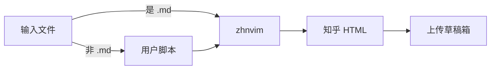

# Zhihu on Neovim

[English Version](./README.md)

使用 [neovim](https://github.com/neovim/neovim) 提升你的 [知乎](https://www.zhihu.com/) 写作体验，灵感来源于 [zhihu_obsidian](https://github.com/dongguaguaguagua/zhihu_obsidian)。

## 安装

> 使用`lazy.nvim` 安装：
```lua
return {
  "pxwg/zhihu_neovim",
  build = "bash deploy.sh",
  dependencies = { "nvim-lua/plenary.nvim" },
  main = "zhvim",
  ---@type ZhnvimConfigs
  opts = {
    default_browser = "chrome",
    browser = {
      firefox = {
        interface = false,
        init_url = "https://www.zhihu.com/",
        path = util.get_browser_path("firefox") or "Unknown Firefox path",
        db_path = util.get_firefox_cookies_path() or "Unknown Firefox DB path",
      },
      chrome = {
        interface = true,
        timeout = 10,
        init_url = "https://www.zhihu.com/",
        path = util.get_browser_path("chrome") or "Unknown Chrome path",
        port = 9222,
      },
    },
    script = {
      typst = {
        pattern = "*.typ",
        extension = { typ = "typst" },
        script = your_script, -- your custom script function
      },
    },
  },
}
```

## 依赖

<!-- TODO: 添加依赖管理 -->
- Rust 工具链、curl、python。
- 目前只支持 *nix 系统，Windows 支持正在开发中 (但我手上没有 Windows 电脑，所以进度不会很快)。

## 使用

- 在 Neovim 中打开本地文件；
- 保存你的 cookie：
  - 使用 `:ZhihuAuth` 命令（目前支持 `firefox` 或 `chrome`）：
    - 如果输入 `:ZhihuAuth browser_name interface`，插件会打开浏览器并引导你登录（仅支持 Chrome），然后将 cookie 保存在 `vim.g.zhvim_cookies` 中；
    - 如果未输入 `:ZhihuAuth browser_name interface`，插件会尝试直接从浏览器的 cookie 数据库读取（支持 Chromium 和 Firefox），并保存到 `vim.g.zhvim_cookies`；
  - 你也可以手动编辑全局变量 `$ZHIVIM_COOKIES` 或 `vim.g.zhvim_cookies`，插件会用它来验证你的知乎账户。
  - 插件**绝不会**自动将你的 cookie 保存到文件系统或与他人分享，你可以放心在私有环境中使用。
- 运行 `:ZhihuDraft` 来初始化或更新草稿；
  - 如果文件类型为 `markdown`，插件会自动检测并将其转换为知乎风格的 HTML，随后使用你的 cookie 通过知乎 API 上传到草稿箱；
  - 如果文件类型匹配配置中的 `script[filetype]`，你需要先用脚本（如 `pandoc`）将其转换为 [CommonMark](https://spec.commonmark.org/)，插件会再将其转换为知乎风格 HTML 并上传到草稿箱；
- 运行 `:ZhihuOpen` 在浏览器中打开草稿箱；
- 运行 `:ZhihuSync` 进入 diff 页面，对比知乎网页版本和本地 Markdown 文件的差异，并使用 Neovim 内置的 diff 功能进行同步编辑；
- 运行 `:ZhihuLink attach` 或 `:ZhihuLink detach` 来将当前文件与知乎文章关联或解除关联，进而编辑文件并同步到知乎文章。

### 转换脚本

`zhihu_on_neovim` 提供了一个转换 API（由 Rust 实现，编译为 Lua 动态库），用于将本地 CommonMark 文件转换为知乎风格的 HTML 并上传为草稿。

默认只直接支持 `.md` 文件。对于其他文件类型，你可以定义一个 Lua 脚本，先将其转换为 CommonMark，再由本插件接管后续处理。



自定义脚本需要是一个符合以下签名的 Lua 函数：
```lua
---@param input input_content
---@return output md_content
local your_script = function(input)
  -- 你的脚本逻辑
  return output
end
```
其中 `input_content` 包含：
```lua
---@field content string  -- 文件内容
---@field title string    -- 文件标题
---@field path string     -- 文件路径
```
`md_content` 应返回：
```lua
---@field content_md string  -- Markdown 内容
---@field title_md string    -- Markdown 标题
```

示例：使用 `pandoc` 和自定义的 Lua 过滤器将 Typst 文件转换为 Markdown：
```lua
local function typst_script(content)
  local cmd = {
    "pandoc",
    content.path,
    "-t",
    "markdown",
    "--lua-filter=" .. vim.fn.stdpath("config") .. "/typ_md.lua",
  }
  local result = vim.fn.system(cmd)
  if vim.v.shell_error ~= 0 then
    return { title = content.title, content = "错误: " .. result }
  end
  return { title = content.title, content = result }
end
```

## 功能
- 将本地 Markdown 文件转换为知乎文章并发送到草稿箱；
- 通过用户自定义脚本，支持将其他类型的文件转换为知乎文章并上传；
- 将云端知乎文章同步到本地。

## 待办事项
- 支持 Windows；
- 支持编辑知乎回答；
- 支持直接发布文章和回答（绕过草稿箱）；
- 添加 [blink-cmp](https://github.com/Saghen/blink.cmp) 支持，用于自动补全 @用户 和 #话题；
- 开发和测试更健壮的转换库，以 100% 兼容知乎的 HTML 格式。

## 不支持的功能
- 在 Neovim 中阅读知乎。
